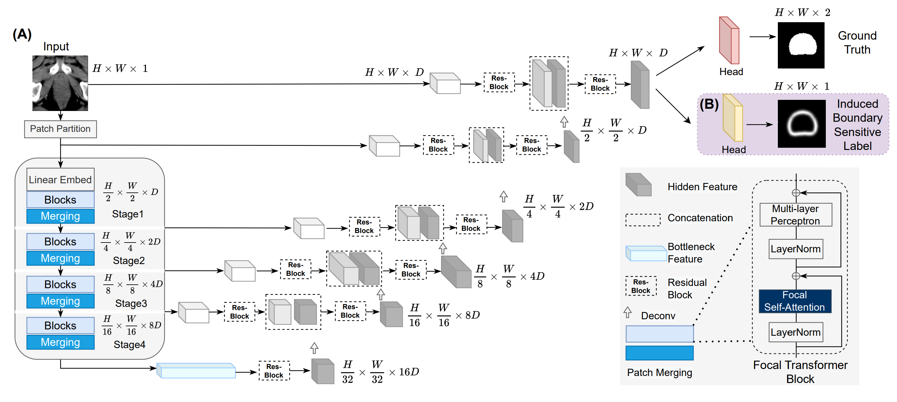

# FocalUNETR
A Focal Transformer for Boundary-aware Prostate Segmentation using CT Images (MICCAI20223, [paper link](https://arxiv.org/abs/2210.03189))

## Data Preprocessing
- You can refer to [this link](https://github.com/llmir/MultitaskOCTA) for generating boundaries of the organ you would like to segment.
- Please refer [here](https://github.com/yhygao/CBIM-Medical-Image-Segmentation) for the convention of your original datasets, e.g., resampling operations, cropping, and padding.
## For Training and Testing
- Following the configurations in the folders with `yml` files, you can train and test with both w/wo contours. 
- For more baseline models you can refer to [this link](https://github.com/yhygao/CBIM-Medical-Image-Segmentation).
## To DO
- Tutorials for inference and visualization.
- ..
